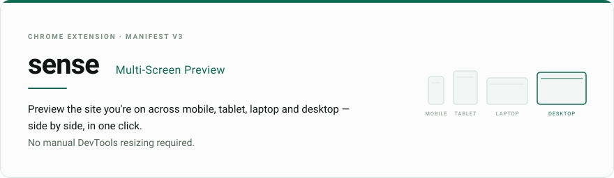
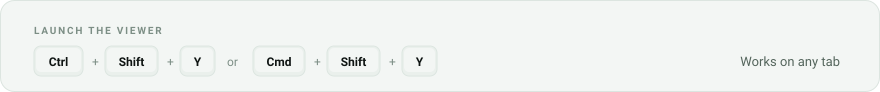
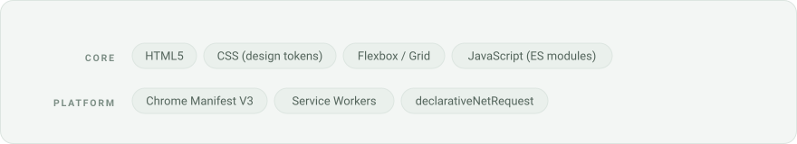

<picture>
  <source media="(prefers-color-scheme: dark)" srcset="assets/hero-dark.svg">
  <source media="(prefers-color-scheme: light)" srcset="assets/hero-light.svg">
  
</picture>

<p>
<a href="https://chromewebstore.google.com/search/sense%20multi%20screen%20preview">
  <picture>
    <source media="(prefers-color-scheme: dark)" srcset="assets/btn-store-dark.svg">
    <source media="(prefers-color-scheme: light)" srcset="assets/btn-store-light.svg">
    
  </picture>
</a>
<a href="https://itsmebryle.com">
  <picture>
    <source media="(prefers-color-scheme: dark)" srcset="assets/btn-site-dark.svg">
    <source media="(prefers-color-scheme: light)" srcset="assets/btn-site-light.svg">
    
  </picture>
</a>
<a href="https://github.com/mgabriel23">
  <picture>
    <source media="(prefers-color-scheme: dark)" srcset="assets/btn-author-dark.svg">
    <source media="(prefers-color-scheme: light)" srcset="assets/btn-author-light.svg">
    
  </picture>
</a>
</p>

## Preview

| Multi-Device Preview Grid | Device List Options Page |
| :---: | :---: |
|  |  |

## Features

- **Side-by-side viewports** — Instant 4-screen layout rendering mobile, tablet, laptop, and desktop viewports simultaneously.
- **Per-card device swapping** — Toggle between popular presets (iPhone 14, Pixel 7, Galaxy S21, iPad, MacBook, 1080p Desktop) independently for each category.
- **Independent orientation toggles** — Rotate individual device cards between portrait and landscape modes with dedicated status badges.
- **Smart URL navigation and history** — Edit the top URL bar to switch target pages, refresh all frames, or access a quick dropdown history of your last 8 previewed URLs.
- **Selective category filters** — Toggle visibility for specific device types, so you can isolate mobile and tablet viewports on their own.
- **High-res screenshot export** — Capture and crop full-page or single-card PNG previews instantly, with auto-scroll calculation.
- **Custom device manager** — Add, remove, or reset target devices per category from the options page.
- **Persistent preferences** — Automatically saves and restores your last-used target URL, active device presets, orientations, and category visibility.
- **Iframe header unblocking** — Uses Chrome's `declarativeNetRequest` engine to strip restrictive frame headers (`X-Frame-Options`, `Content-Security-Policy: frame-ancestors`), isolated to Sense preview tabs.

### Launching it

<picture>
  <source media="(prefers-color-scheme: dark)" srcset="assets/shortcut-dark.svg">
  <source media="(prefers-color-scheme: light)" srcset="assets/shortcut-light.svg">
  
</picture>

Or click the Sense icon in your toolbar on any tab.

## Tech Stack

<picture>
  <source media="(prefers-color-scheme: dark)" srcset="assets/stack-dark.svg">
  <source media="(prefers-color-scheme: light)" srcset="assets/stack-light.svg">
  
</picture>

## Permissions

Sense requests the minimum needed to render live pages inside frames.

| Permission | Why it is needed |
| :--- | :--- |
| `declarativeNetRequestWithHostAccess` + `<all_urls>` | Bypasses iframe embedding blocks on a per-tab basis. |
| `storage` | Persists URLs, settings, and device presets locally. |
| `scripting`, `webNavigation` | Measure scroll heights across frame contexts for full-page screenshot exports. |

## Install

**From the Chrome Web Store**

Open [the listing](https://chromewebstore.google.com/search/sense%20multi%20screen%20preview) and click **Add to Chrome**.

**From source, for development**

```bash
git clone https://github.com/mgabriel23/sense.git
```

1. Open `chrome://extensions` and enable **Developer mode**.
2. Click **Load unpacked** and select the cloned folder.
3. Press `Ctrl+Shift+Y` on any tab to launch the viewer.

---

Built by [Mark Bryan Gabriel](https://github.com/mgabriel23) · [itsmebryle.com](https://itsmebryle.com)
